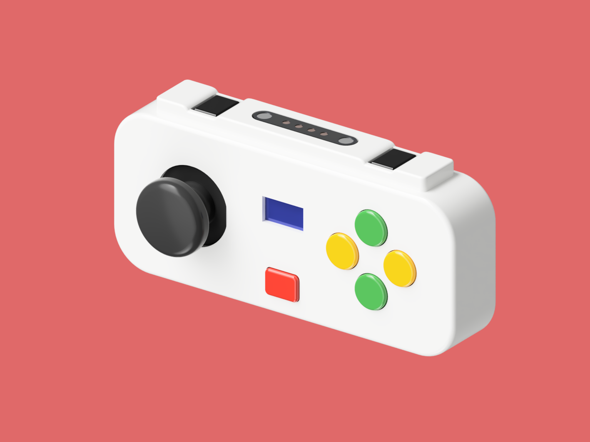
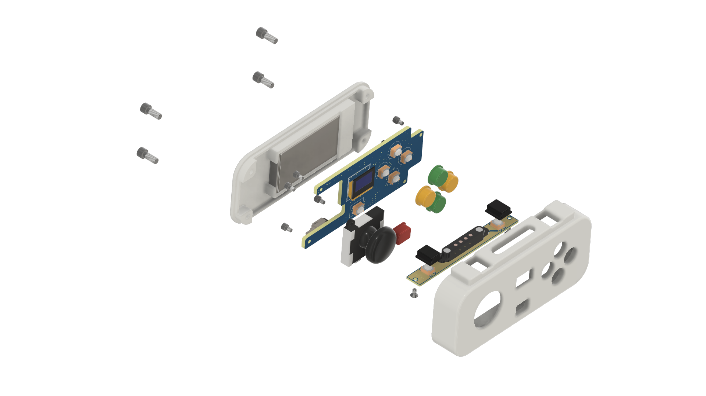
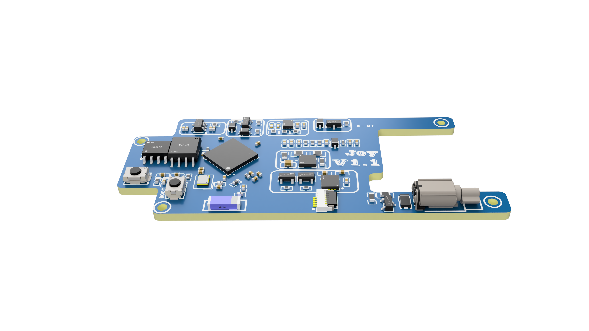
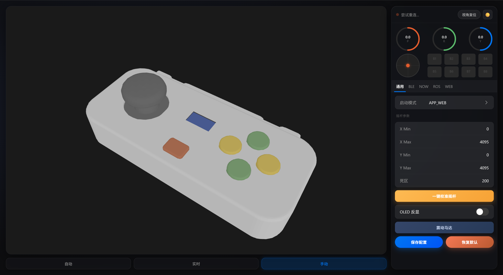
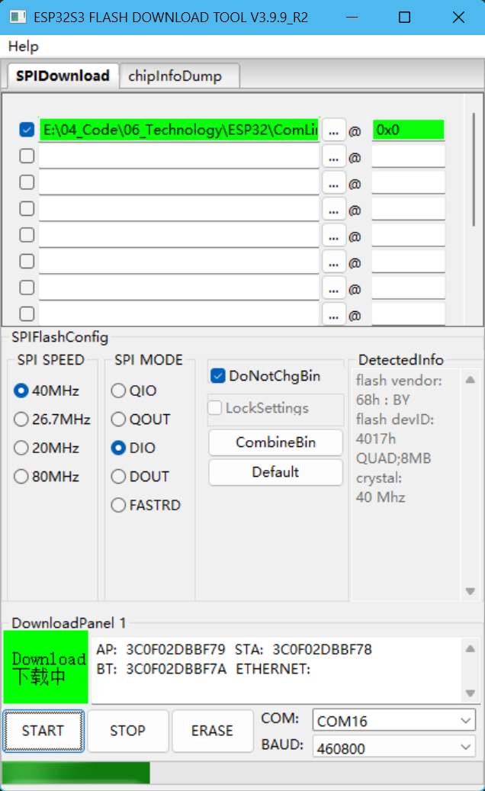
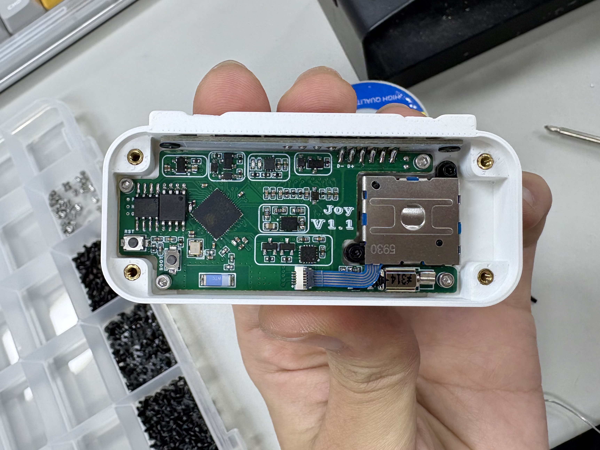

# ComLink-Gamepad: 万能控制器
   [](https://docs.espressif.com/projects/esp-idf/en/v5.5.1/esp32/get-started/index.html) [](https://docs.ros.org/en/humble/index.html)   [](LICENSE)  [](https://space.bilibili.com/493340537?spm_id_from=333.1007.0.0) 


> 注: 此仓库提供ComLink项目包括软硬件全部资源,仅用于学习,禁止商用.  
> Video URL: [Bilibili](https://www.bilibili.com/video/BV16HPvzfEEj/?spm_id_from=333.1387.homepage.video_card.click&vd_source=7a1c804b8a7b1537f128842d58ce5a24)

### 📈开发进度:
- [x] **HID 蓝牙设备模拟**
  - [x] 手柄
  - [x] 键盘
  - [x] 鼠标
  - [x] 多媒体
- [x] **ROS2 中数据交换**
  - [x] 发布手柄话题数据
  - [ ] 接收 Agent 反馈数据(屏幕查看/触发震动)
- [x] **ESP-NOW 与接收机互通**
  - [x] 广播通讯
  - [x] 点对点通讯
- [x] **Web 网页终端**
  - [x] 手柄数据可视化
  - [x] 手柄功能测试
  - [x] 参数配置与保存

### 📅TODO:
- 有线模式: 接入 **Openclaw**, 借助控制器内置的 ESP-NOW 和 ROS2 的通讯通道, 实现对下位机(机器人)的控制接管.

# 项目介绍
### 简介:
之所以做这个项目是因为在平时做机器人或嵌入式开发中更多的是专注于控制部分, 上电运行测试或调试常常是直接使用板载开关手动操作(操作受限)或借助无线串口模块用键盘操作(不够优雅), 为了解决前面的痛点, 本着造轮子就要造个大的的态度, 就有了这一版的万能控制器; 得益于 ESP32 优秀的生态, 能够使用底层的WiFi/BLE协议栈构建起各式各样的连接方式, 真正实现了 **Com(共)Link(连)** 的目标🌟
### 关于结构:

手柄外观设计灵感来源于 Switch 的 Joy-Con 手柄, 我第一次看到时就被它极具创新的连接与交互方式吸引到了, 并将其部分设计理念运用到了该项目;

**模块与个性化:** 通过顶部凸槽的磁吸连接器可以轻松的连接充电底座; 控制器整体设计尽可能保证对称和整洁, 使其便于 DIY 各式各样的拓展配件(握把/方向盘...), 咔哒! 即连!
>仓库添加了配备磁铁安装孔位的底板, 使磁吸角度不仅限于控制器顶部.

**感知与交互:** 内部配置了六轴运动姿态传感器, 配备高精度滤波算法, 可以实现多样的交互方式, 还有震动马达加持(受限于空间利用, 没有使用线性马达, 待升级), 提供不错的触觉反馈.

### 关于硬件
项目一共涉及到3块 PCB 的制作, 副板和底板负责用于拓展接口, 主板双面四层设计, 部分元件需要电烙铁焊接, 电源为一块400mAh的锂电池, 摇杆模块使用的Joy-Con同款; 主控使用ESP32S3N8R8, 板载CH343P和SGM4056用于串口转USB和电池充电保护, 配备长按开关机电路, 保证按键复用性与机身简洁, 采用双电源切换电路, 自由切换主机供电或电池供电.

### 关于软件
目前开发的核心身份有三个, 分别是**HID设备,ESP-NOW主机和micro-ROS节点**, 所有功能都由它们拓展开来:
- HID设备可以配置为游戏手柄,键盘,鼠标,多媒体设备; 其中键盘和多媒体设备的按键宏和各种模式都可以通过 Web 网页在线配置.
- ESP-NOW 可以点对点或广播方式和烧录了接收机固件的ESP32开发板通讯, 接收机则能将接收到的数据转换成不同协议格式给主设备(主控板/飞控).
- micro-ROS 中将手柄作为 Node 接入运行 Agent 的主机, 通过 Topic 发送控制器摇杆/陀螺仪/按键的数据.

系统的大部分参数都可以在基于 Vue 构建的网页中进行配置, 网页也设计了良好的交互功能, 能够实时查看控制器实时运行状态, 测试控制器功能, 由于使用了 vant 作为 UI 框架, 使其在移动端和电脑端都有不错的兼容性.

# 关于复刻
**结构上**,所有零件都是使用热熔铜螺母加螺丝或过盈配合安装,不需要使用胶水; 打印控制器的顶壳底壳和各种按键时, 摆放最好是空腔朝上, 普通支撑, 顶部Z轴距离设置为0.1mm, 效果会比较好.  
**电路上**, 最好给主板开张钢网, 成功率会高很多, 某宝十几块; 摇杆模块要买碳刷的, 可以直接使用拆机件; 屏幕0.42寸分辨率72x40, 驱动为SSD1306, 网上现存货好像不多了, 主要是卖的是SSD1315驱动的, 这个驱动没测试过; CH343P 芯片要渠道最好要正规, 我买到一块假的导致折腾了好久😭; 主板背面的RST和BOOT按键, Flash芯片和主控之间的LED都是可以不用焊接的, 主要用于板级调试; 现版本的电池充电IC的充电电流我设置的很小, 如果需要调节可以设置标号R42和R43的电阻阻值, 充电指示灯和满电指示灯在焊接时要注意区分颜色.  
**装配上**, 副板和主板连接是通过六根金手指焊接起来的, 一定要注意焊接的时间与温度, 没控制好容易导致外壳受热变形; 磁吸连接器的公和母在焊接前要确定方向, 保证能在底座正确方向吸合;  
**软件上**, 没有ESP-IDF开发环境的可以通过乐鑫官方的烧录工具, Firmware 中提供了编译好的二进制固件, 烧录时要全程按住中间的功能键, 由于固件较大, 烧录时间较长, 可以直接拿个小夹子夹住按键进行烧录.  
> 使用 Flash Download Tool 时注意, 固件的地址栏要填写 `0x0`, 其他保持默认即可.  
> 下载地址: [Flash Download Tool](https://docs.espressif.com/projects/esp-test-tools/zh_CN/latest/esp32/production_stage/tools/flash_download_tool.html)  


**总体复刻难度中等, 材料成本90RMB左右.**

# 二次开发
>本项目开发环境为Windows+Docker
```
ComLink/
├── main/ 
│   └── main.cpp
│
├── my_components/ 
│   ├── apps/                      
│   │   ├── app_ble.c              
│   │   ├── app_now.cpp            
│   │   ├── app_ros.cpp           
│   │   ├── app_web.cpp           
│   │   └── mode.cpp               
│   │
│   ├── bsp/                               
│   │
│   ├── micro_ros/                 
│   │
│   └── utils/                          
│
├── web_vue/                     
│   └── src/

├── CMakeLists.txt             
├── sdkconfig                   
├── partitions.csv               
├── deploy_web.ps1               
└── docker_build.ps1             
```
**控制器程序分成三层: BSP - Utils - Apps**
> 在apps中可以创建自己的应用, 应用需在`mode.cpp`中进行**注册**;  
> 注册核心包括:配置初始化函数和反初始化函数, 注册FreeRTOS任务函数;  
> 其他还需要修改`sys_mode_t`枚举, OLED动画, 前端界面等.   

### 编译micro-ROS固件
> 在 原生 Linux 或 WSL2 下, 就不用Docker编译了.
1. 在 Docker 图形界面或终端中找到`espressif/idf:v5.5.1`的镜像下载;
2. 将`micro_ros`中的`CMakeLists.txt`的内容和`CMakeLists.txt.old`内容对调(由静态链接转换为动态链接);
3. 手动删除`build`目录;
4. 在项目中打开终端, 执行`.\docker_build.ps1`进行自动编译;
5. 编译完成后重复步骤2和步骤3即可完成(不删除 build 目录会导致交叉工具链错误).

### 前端Web页面开发
1. `cd web_vue`进入前端工程目录;
2. `npm run dev`运行工程, 网页查看效果;
3. `cd ..`回到主目录;
4. `.\deploy_web.ps1`自动部署网页;
5. 部署完成后需重新编译项目工程.

# 结语
前面就项目的特点进行了讲解, 复刻与开发注意事项进行了说明; 项目中可能还存在许多还没发现的 BUG 有待优化, 欢迎 PR, 后期也还会对功能扩充(敬请期待~), 如果有好的想法也欢迎提出, 如果觉得项目不错, 可以给仓库点个小星星🌟

# 参考资料
- [ESP-IDF 官方文档](https://docs.espressif.com/projects/esp-idf/zh_CN/v5.5.3/esp32s3/versions.html)
- [micro-ROS 组件](https://github.com/micro-ROS/micro_ros_espidf_component)
- [U8g2 图形库](https://github.com/olikraus/u8g2)
- [Vant 开发文档](https://vant-ui.github.io/vant-weapp/#/home)
- [核心板电路](https://oshwhub.com/li-chuang-kai-fa-ban/li-chuang-esp32s3r8n8-kai-fa-ban)
